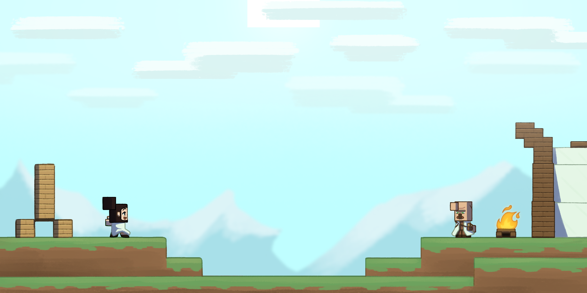

# Ruins of Growsseth

# [**DESCRIZIONE IN ITALIANO QUA!**](docs/README_ITA.md)

A highly configurable structures mod, with a smart NPC to sell maps and guide you in discovery, and structures 
that hint to vanilla features taking inspiration from Broken Nether Portals. 

Adapted from a mod made for the italian streamer Cydonia, as such also contains discs, trims, and more 
with content from his community and assorted easter eggs (also configurable). Also, it contains a custom
world preset (Growsseth) that generate the world with the same seed as his run, and the mod's structures
in the positions they were placed in it.

The mod features cut content and other features not seen in the original run, most importantly a progression
quest for the Researcher NPC.

Finally, the mod includes a web-tool to act as a Gamemaster to another player's run, similarly to Cydonia's
original run, being able to spawn structures, tweak trades, and send notifications.

See the [Modrinth](https://modrinth.com/mod/ruins-of-growsseth) or [Curseforge](https://curseforge.com/minecraft/mc-mods/ruins-of-growsseth) page, and the [**WIKI**](https://github.com/filloax/ruins-of-growsseth/wiki) (currently Italian only until full release) for more information.

### Requirements

The mod currently is only available for 1.20.6 with Fabric, and requires [Fabric API](https://modrinth.com/mod/fabric-api) and [Resourceful Config](https://modrinth.com/mod/resourceful-config). 
[Mod Menu](https://modrinth.com/mod/modmenu) is highly suggested for a simpler configuration UI ingame.

Future plans include releasing the mod for Neoforge and other 1.20.x (and future versions) too.

The mod also includes [Fx-Lib](https://github.com/filloax/FX-Lib/), so it's not needed to be installed (for now).

### Credits

Ruslan Fanclub:
- Filloax (Lead Programmer)
- Krozzzt (Programming and Writing)
- Reivaxelain (Art, Structures and Writing)
- bb01 (Structures, Additional Writing and Additional Testing)
- SkullFury (Original member, Datapack Management)
- Vovalcool (Original member, Structures)
- Everyone: Design and Testing

Contributors:
- Sync_Gabri (Supervisor, Coordinator and Writer for the Cydonia's version) and 
  Worgage (API Integration, Testing and Writing for the Cydonia's version)
  from the [Project Egobalego](https://projectegobalego.com/) team
- Simone Russo (Sound Effect)
- Farcr (Guber texture)

Musical artists:
- Il Coro di Mammonk (A Padre Mammonk, La Missiva nell'Ombra)
- Singalek (Binobinooo, Giorgio Cubetti, Giorgio Lo-Fi)
- HunterProduction (Giorgio Finding Home)
- Ako & R-E-M (Abbandonati)
- Guber (Una sega di niente)

### Developers

I plan to release some of the mod features (like language settings for structure texts, NPCs, and such) as 
a library sooner or after; for now the mod is not available with maven to add support, will try to do it as it
gets out of pre-release.