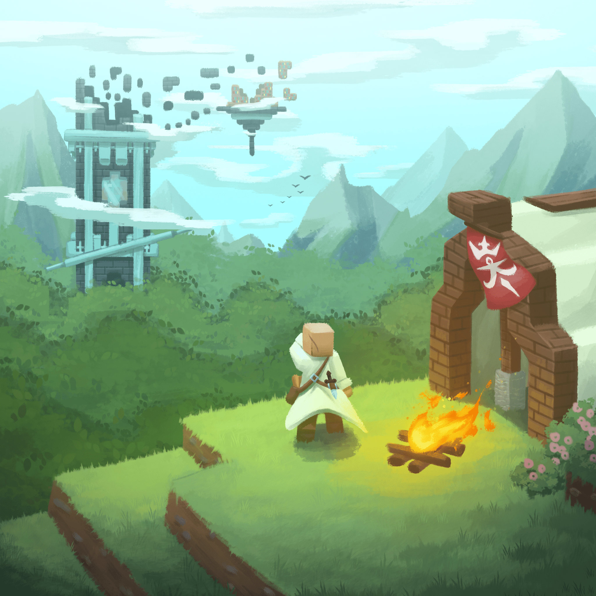

# Ruins of Growsseth

## [**README IN ITALIANO QUA!**](docs/README_ITA.md)

A highly configurable structures mod, with a smart NPC to sell maps and guide you in discovery, and structures 
that hint to vanilla features taking inspiration from Broken Nether Portals.

> Feeling brave? You can try the latest in-dev release [here](https://github.com/filloax/ruins-of-growsseth/releases/tag/nightly-release-1.21)!

Adapted from a mod made for the italian streamer Cydonia, as such also contains discs, trims, and more 
with content from his community and assorted easter eggs (also configurable). Also, it contains a custom
world preset (Growsseth) that generate the world with the same seed as his run, and the mod's structures
in the positions they were placed in it.

The mod features cut content and other features not seen in the original run, most importantly a progression
quest for the Researcher NPC.

Finally, the mod includes a web-tool to act as a Gamemaster to another player's run, similarly to Cydonia's
original run, being able to spawn structures, tweak trades, and send notifications.

See the [Modrinth](https://modrinth.com/mod/ruins-of-growsseth) or [Curseforge](https://curseforge.com/minecraft/mc-mods/ruins-of-growsseth) page, and the [**WIKI**](https://github.com/filloax/ruins-of-growsseth/wiki) for more information.
For bug reports check the [Issues](https://github.com/filloax/ruins-of-growsseth/issues), for ideas and suggestions check the [Discussions](https://github.com/filloax/ruins-of-growsseth/discussions).

### Requirements

The mod currently is only available for Fabric, and requires [Fabric API](https://modrinth.com/mod/fabric-api) and [Resourceful Config](https://modrinth.com/mod/resourceful-config). 
[Mod Menu](https://modrinth.com/mod/modmenu) is highly suggested for a simpler configuration UI ingame.

Future plans include releasing the mod for Neoforge and other 1.20.x (and future versions) too.

The mod also includes [Fx-Lib](https://github.com/filloax/FX-Lib/), so it's not needed to be installed (for now).

### Credits

Ruslan Fanclub:
- Filloax (Lead Programmer)
- Krozzzt (Programming and Writing)
- Reivaxelain (Art, Structures and Writing)
- bb01 (Structures, Additional Writing and Additional Testing)
- SkullFury (Original member, Datapack Management)
- Vovalcool (Original member, Structures)
- Everyone: Design and Testing

Contributors:
- Sync_Gabri (Supervisor, Coordinator and Writer for the Cydonia's version) and 
  Worgage (API Integration, Testing and Writing for the Cydonia's version)
  from the [Project Egobalego](https://projectegobalego.com/) team
- Simone Russo (Sound Effect)
- Farcr (Guber texture)

Musical artists:
- Il Coro di Mammonk (Ancora Qui, La Ballata Del Respawn, Il Tesoro Di CacoCaco, La Missiva Nell'Ombra, Odi et Amo, Oursteps, Elogio a Padre Mammonk, Pesci Strani)
- Singalek (Binobinooo, Giorgio Cubetti, Giorgio Lo-Fi)
- HunterProduction (Giorgio Finding Home)
- Hawkelele (Giorgio Cub8bit)
- Ako & R-E-M (Abbandonati)
- Guber (Una sega di niente)

### Developers

As this mod wouldn't have been possible without the help of the community, and most mods code being freely available only to be able to look at examples of how things are done, feel free to use this mod to look at examples of how to do the thing it does, as we do various specific and niche things in this mods' features (but do note that this is Filloax and Krozzt's first minecraft mod). In particular (also to aid google searches that might be needing this), this mod contains examples of:
- Explorer maps that lead to villages with specific houses
- Disabling/enabling structures and village houses via config and not only datapack
- Language settings for structure elements, books, signs (nyi), etc.
- Locate structure functionality with timeout
- NPCs with dialogue
- Detecting if a player has explored a structure
- Connecting to external endpoints for special interactions (referring to the Gamemaster functionalities)
- Spawning leashed entities in structures
- Custom merchant villager-like entities

I plan to release some of the mod features (like language settings for structure texts, NPCs, and such) as 
a library sooner or after; for now the mod is not available with maven to add support, will try to do it as it
gets out of pre-release.
