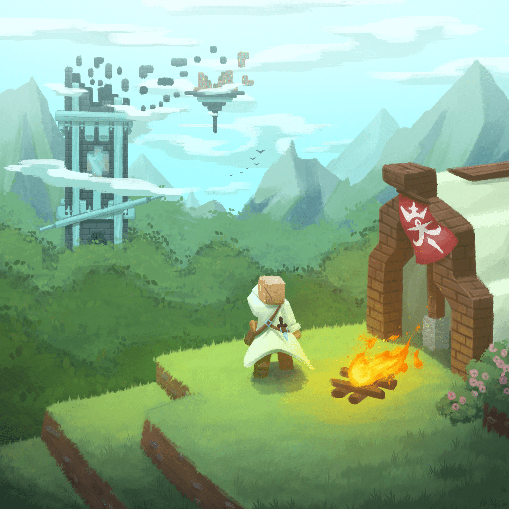
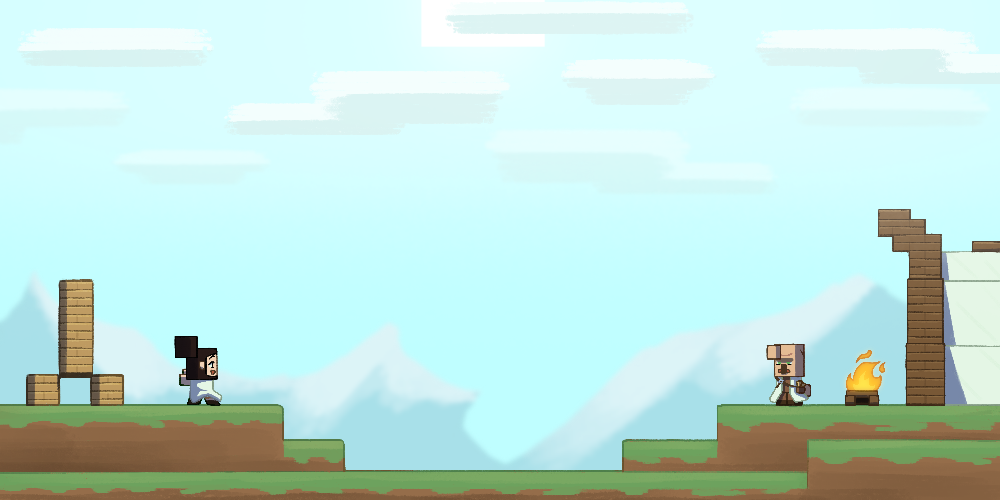

# Ruins of Growsseth

Nota per gli sviluppatori: questo branch crea e sovrascrive automaticamente la [build nightly](https://github.com/filloax/ruins-of-growsseth/releases/tag/nightly-release-1.20.6) a ogni push.

Una mod di strutture altamente configurabile, con un NPC intelligente per vendere mappe e guidare nel
percorso, e strutture che suggeriscono feature vanilla allo stesso modo dei Portali del Nether Rotti.

> Hai voglia di rischiare? Puoi provare l'ultima versione in via di sviluppo [da qui](https://github.com/filloax/ruins-of-growsseth/releases/tag/nightly-release-1.20.6)!

Adattata dalla mod creata per la run dello streamer **Cydonia**; contiene quindi dischi, armor trim, e altro
con contenuto dalla sua community e easter egg varie (anche esse configurabili). Contiene anche un **preset di generazione mondo**
(Growsseth) per generare un mondo con lo stesso seed e le strutture della mod nelle posizioni originali.

La mod contiene anche cut content e altre feature non viste nella run originale, soprattutto una quest di progressione
per l'NPC del ricercatore.

In ultimo, la mod include una *console da Gamemaster*, per "masterare" la run di un giocatore in modo simile
alla run di Cydonia, con spawn di strutture, modifiche agli scambi, invio notifiche e altro.

Vedi le pagine [Modrinth](https://modrinth.com/mod/ruins-of-growsseth) e [Curseforge](https://curseforge.com/minecraft/mc-mods/ruins-of-growsseth), e la [**WIKI**](https://github.com/filloax/ruins-of-growsseth/wiki) per maggiori informazioni.
Per segnalare bug c'è la sezione [Issues](https://github.com/filloax/ruins-of-growsseth/issues), per idee e suggerimenti la sezione [Discussions](https://github.com/filloax/ruins-of-growsseth/discussions).

### Requisiti

La mod è attualmente disponibile per Fabric, e richiede [Fabric API](https://modrinth.com/mod/fabric-api) e [Resourceful Config](https://modrinth.com/mod/resourceful-config). 
[Mod Menu](https://modrinth.com/mod/modmenu) è altamente consigliata per impostazioni visibili ingame.

La mod include [Fx-Lib](https://github.com/filloax/FX-Lib/), ma in futuro potrebbe essere richiesta l'installazione a parte.

### Credits

Ruslan Fanclub:
- Filloax (Lead Programmer)
- Krozzzt (Programmazione e scrittura)
- Reivaxelain (Arte, strutture e scrittura)
- bb01 (Strutture, scrittura aggiuntiva e testing aggiuntivo)
- SkullFury (Membro originale, creazione datapack)
- Vovalcool (Membro originale, strutture)
- Tutti quanti: Design e testing

Collaboratori:
- Sync_Gabri (Supervisore, coordinatore e scrittore per la versione di Cydonia) e
  Worgage (Integrazione API, testing e scrittura per la versione di Cydonia)
  del team di [Project Egobalego](https://projectegobalego.com/)
- Simone Russo (Sound effect)
- Farcr (Texture di Guber)

Artisti musicali:
- Il Coro di Mammonk (Ancora Qui, La Ballata Del Respawn, Il Tesoro Di CacoCaco, La Missiva Nell'Ombra, Odi et Amo, Oursteps, Elogio a Padre Mammonk, Pesci Strani)
- Singalek (Binobinooo, Giorgio Cubetti, Giorgio Lo-Fi)
- HunterProduction (Giorgio Finding Home)
- Hawkelele (Giorgio Cub8bit)
- Ako & R-E-M (Abbandonati)
- Guber (Una sega di niente)

### Sviluppatori

[vedi eng, se sei uno sviluppatore probabilmente sai l'inglese e sono troppo stanco per tradurre pure quello e aggiornarlo in futuro lmao]

